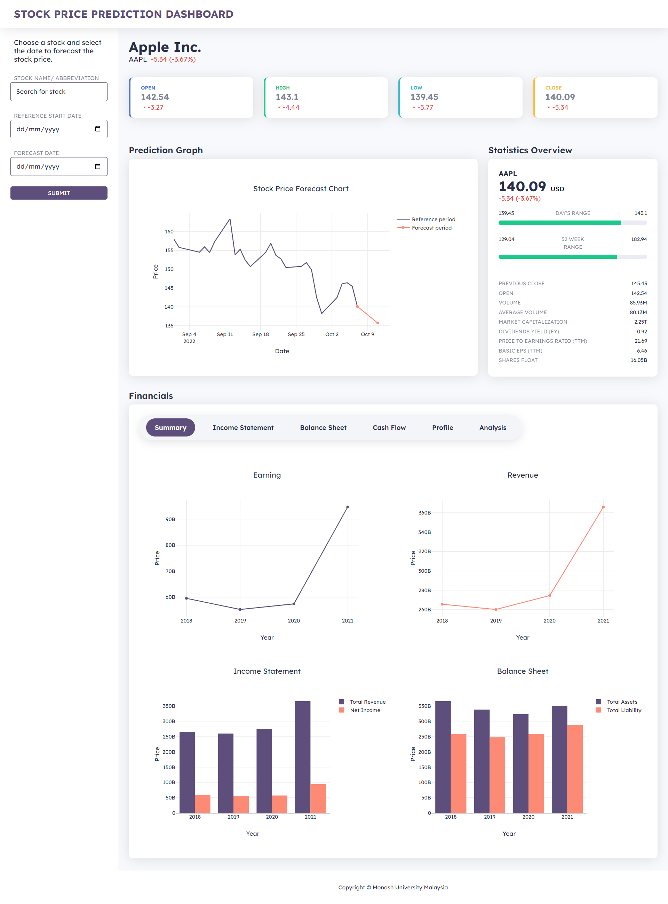

# Stock Price Prediction App

## Motivation
This project is centerd on providing a tool that can be used to forecast accurately, professional or personal use, the future stock price of companies, this helps to improve accuracy of financial analysis and also gain value on investment.

A meta learning model is used to help reduce the need for large datasets on training the model for computational effiency.

## Machine Learning model used:
N-BEATS Model

## Technologies & Libraries used:

### Technoloogies
* Python for backend
* Flask framework for integration of frontend and backend
* JavaScript frame work with CSS and HTML for front end
* Plotly for plotting

### Libraries
* numpy
* requests
* datetime
* matplotlib
* numpy
* pandas
* quandl
* datetime 
* Flask
* statsmodels.tsa.statespace.sarimax 
* datetime 
* pandas.tseries.offsets.DateOffset
* plotly.graph_objs.Scatter

### Summary of Output

## Steps to run the code
* Clone the github repository or download the zip file
* Navigate to the folder `Stock Market Prediction App` by running `cd Stock Market Prediction App` on the terminal
* Run `pip install -r requirements.txt`
* Run `flask run` - this starts the http server using python flask
* Open the port `http://127.0.0.1:5000/` on the browser

